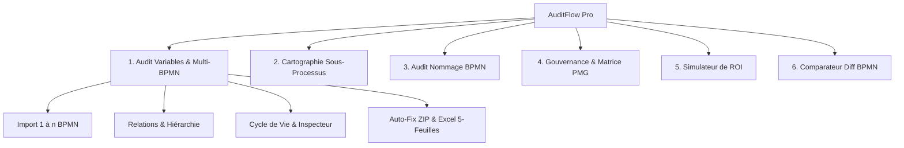

# 🚀 Bouygues Telecom - AuditFlow Pro
### Suite Complète d'Audit, de Cartographie Hiérarchique Multi-BPMN et de Gouvernance des Processus Camunda


**AuditFlow Pro** est la plateforme unifiée de gouvernance, d'audit qualité et d'analyse d'impact des processus métier BPMN pour **Camunda Platform 7** et **Camunda Platform 8 (Zeebe)**. Développée selon les plus hauts standards d'ergonomie et de performance (HTML5, CSS3 Vanilla, JavaScript ES6+ moderne), l'application s'exécute intégralement dans le navigateur sans nécessiter de serveur applicatif backend, garantissant une sécurité et une confidentialité totales de vos diagrammes et variables métier.

---

## 📑 Sommaire

1. [🌟 Points Forts & Architecture](#-points-forts--architecture)
2. [🧭 Les 6 Modules de la Suite](#-les-6-modules-de-la-suite)
   - [Module 1 : Audit des Variables & Multi-BPMN (1 à n Fichiers)](#1-module-audit-des-variables--multi-bpmn-1-à-n-fichiers)
   - [Module 2 : Analyse des Sous-processus & Dépendances](#2-module-analyse-des-sous-processus--dépendances)
   - [Module 3 : Audit de Nommage des Éléments BPMN](#3-module-audit-de-nommage-des-éléments-bpmn)
   - [Module 4 : Gouvernance & Matrice PMG (Process Matrix Governance)](#4-module-gouvernance--matrice-pmg-process-matrix-governance)
   - [Module 5 : Simulateur de ROI & Gain de Temps](#5-module-simulateur-de-roi--gain-de-temps)
   - [Module 6 : Comparateur de Versions BPMN (Visual Diff)](#6-module-comparateur-de-versions-bpmn-visual-diff)
3. [📋 Référentiel des Règles de Nommage & Conformité](#-référentiel-des-règles-de-nommage--conformité)
4. [🛠️ Guide d'Utilisation Étape par Étape](#️-guide-dutilisation-étape-par-étape)
5. [📦 Formats d'Exportation & Rapports](#-formats-dexportation--rapports)
6. [🔐 Authentification & Accès](#-authentification--accès)
7. [💻 Installation & Déploiement](#-installation--déploiement)
8. [📂 Structure du Code Source](#-structure-du-code-source)

---

## 🌟 Points Forts & Architecture

- **Zero-Backend & 100% Sécurisé** : L'analyse XML, le calcul des règles, les graphes de corrélation et les générations de fichiers (BPMN, ZIP, Excel, PDF) s'opèrent à 100% côté client. Aucune donnée ne quitte le poste de travail.
- **Support Camunda 7 et Camunda 8 (Zeebe)** : Détection intelligente des extensions d'attributs `camunda:inputOutput`, `camunda:in/out`, `camunda:formData`, `zeebe:ioMapping`, `zeebe:calledElement`, `zeebe:properties`, expressions FEEL (`= varName`) et expressions JUEL (`${varName}`).
- **Moteur Multi-BPMN & Cartographie Hiérarchique** : Importez de 1 à $n$ fichiers BPMN simultanément. Le moteur détecte automatiquement les processus maîtres/racines, les sous-processus subordonnés, les liaisons inter-processus via `callActivity`, les paramètres échangés et les sous-processus manquants.
- **Inspecteur de Traçabilité (Drawer Timeline)** : Visualisation étape par étape du cycle de vie de chaque variable (définition, transmission, lecture dans les conditions/scripts, fin de vie) avec extraits XML en surbrillance.
- **Auto-Fix 1-Clic & Export ZIP Coordonné** : Renommage automatique en `camelCase` standardisé de toutes les variables à travers tous les fichiers BPMN chargés, téléchargeables sous forme d'archive `.zip` prête à déployer.
- **Persistance Locale & Historique (IndexedDB)** : Sauvegarde automatique de l'historique de vos sessions d'audit, avec possibilité d'export/import JSON.

---

## 🧭 Les 6 Modules de la Suite



---

### 1. Module : Audit des Variables & Multi-BPMN (1 à n Fichiers)

Ce module constitue le cœur de la gouvernance des données de vos processus.

#### Fonctionnalités Principales :
1. **Importation Multi-Format & Multi-Fichiers (1 à $n$ BPMN)** :
   - Déposez un ou plusieurs fichiers `.bpmn` ou `.xml` en une seule opération.
   - Prise en charge des fichiers de référentiels **Excel (.xlsx, .xls)** et **CSV** avec assistant de mappage dynamique des colonnes (Variable, Processus Parent, Processus Appelant).
   - **File Batch Queue Manager** : visualisez les cartes de chaque fichier importé avec son `Process ID`, son rôle (Racine vs Sous-processus), ses compteurs de variables, d'activités et de Call Activities.
2. **Cycle de Vie des Variables (Data Lineage)** :
   Chaque variable est qualifiée selon son rôle opérationnel :
   - 🟢 **Producteur (Write)** : Variable instanciée dans une tâche de service, un formulaire utilisateur (`formField`), ou un `outputParameter`.
   - 🔵 **Consommateur (Read)** : Variable lue dans un paramètre d'entrée (`inputParameter`), une condition de flux séquentiel (`conditionExpression`), ou un script.
   - 🟣 **Flux In/Out** : Variable propagée ou réceptionnée à travers les frontières d'un sous-processus via une `callActivity`.
   - 👻 **Variable Morte (Ghost)** : Variable générée dans une tâche mais jamais exploitée en aval dans l'ensemble du lot de processus.
   - ⚠️ **Non Initialisée (Orpheline)** : Variable consommée dans une passerelle conditionnelle ou une tâche sans aucune affectation préalable.
3. **Espace « Relations & Hiérarchie » (`#panel-proc-relations`)** :
   - **5 KPIs en temps réel** : Total Processus, Processus Racines, Sous-processus Liés, Sous-processus Non Fournis (Manquants), Profondeur Maximale d'Appels.
   - **Alerte intelligente de sous-processus manquants** : repère les `calledElement` appelés qui n'ont pas encore été importés dans le lot.
   - **3 Modes de visualisation commutables** :
     - 🌳 **Vue Arborescence (Interactive Tree)** : Arbre hiérarchique dépliable affichant la structure parent/enfants, les métadonnées et un lien direct de filtrage.
     - 🕸️ **Vue Graphe Réseau (Vis.js DAG)** : Cartographie topologique interactive orientée haut-bas avec nœuds différenciés (Orchestrateur en bleu nuit, Sous-processus en bleu ciel, Manquants en orange) et arêtes labellisées.
     - 📋 **Vue Matrice CallActivity & I/O** : Tableau exhaustif listant chaque appel, le sous-processus cible, les flux de variables d'entrée (`in`), les flux de sortie (`out`) et le statut de résolution.
4. **Inspecteur Détaillé de Variable (Slide-over Drawer)** :
   - En cliquant sur n'importe quelle variable ou sur le bouton **🔍 Trace**, un panneau latéral s'ouvre.
   - Affiche les métadonnées de gouvernance (Équipe propriétaire, Niveau de sensibilité : *Public, Interne, Confidentiel, Critique*).
   - **Timeline chronologique des étapes** : retrace chaque intervention sur la variable avec l'extrait XML réel associé.
   - **Zone d'Auto-Fix express** permettant de modifier la suggestion camelCase et de l'appliquer immédiatement.
5. **Auto-Fix Global & Export Multi-Format** :
   - **Package ZIP Multi-BPMN** : Génère une archive contenant tous les fichiers BPMN corrigés avec mise à jour uniforme des noms de variables (y compris au sein des expressions FEEL et JUEL).
   - **Export Excel enrichi (5 feuilles structurées)** : *Synthèse & KPIs*, *Variables & Audit*, *Hiérarchie Processus*, *Call Activities & I-O*, *Anomalies & Variables Mortes*.

---

### 2. Module : Analyse des Sous-processus & Dépendances

Dédié aux cartographies d'architecture d'entreprise et matrices de sous-processus :
- Import de matrices Excel ou CSV recensant les liens parent-enfant.
- **Détection des boucles circulaires** : identification visuelle et textuelle des risques d'appels récursifs infinis.
- **Analyse d'impact** : calcul de criticité de chaque sous-processus selon le nombre de processus appelants et sa centralité dans le SI.
- **Cartographie réseau interactive (Vis.js)** avec filtres de recherche et mise en évidence des nœuds critiques.

---

### 3. Module : Audit de Nommage des Éléments BPMN

Assure l'homogénéité rédactionnelle et la lisibilité des diagrammes BPMN :
- **Tâches (Tasks)** : Contrôle du standard **Verbe à l'infinitif + Complément d'objet direct** (ex: *« Valider le panier client »* et non *« Validation panier »*).
- **Événements de début (Start Events)** : Vérification de la formulation orientée événement passé (ex: *« Commande reçue »*).
- **Événements de fin (End Events)** : Vérification de l'état final atteint (ex: *« Dossier clôturé »*, *« Paiement rejeté »*).
- **Passerelles exclusives / parallèles (Gateways)** : Contrôle de la formulation interrogative (ex: *« Montant > 1000€ ? »*).
- **Identifiants techniques (IDs)** : Validation des préfixes standardisés (`Activity_`, `Event_`, `Gateway_`, `Task_`).

---

### 4. Module : Gouvernance & Matrice PMG (Process Matrix Governance)

Transforme n'importe quel fichier BPMN en matrice documentaire d'ingénierie logicielle :
- **Extraction exhaustive** des activités, pools, lanes et composants.
- **Matrice interactive** : saisie des règles de gestion métier, conditions d'applicabilité et commentaires techniques.
- **Indicateurs de complexité PMG** : calcul de la complexité cyclomatique, du ratio passerelles/tâches et de la complétude documentaire.
- **Générateur de Documentation Technique & Onboarding** : production en un clic d'un dossier technique complet exportable en **Markdown** ou imprimable en **PDF**.

---

### 5. Module : Simulateur de ROI & Gain de Temps

Permet aux Product Owners, Architectes et Managers de quantifier la valeur créée par l'optimisation et la conformité des processus :
- **Paramétrage économique** : Taux horaire moyen (€/h), volume annuel d'instances de processus, temps moyen d'exécution humaine vs automatisée.
- **Calculs automatiques** :
  - Heures économisées par an.
  - Gains financiers bruts et nets (€).
  - Équivalent Temps Plein (ETP) libéré.
  - Période de retour sur investissement (*Payback period*).
- **Export de synthèse financière** pour les comités de direction et revues budgétaires.

---

### 6. Module : Comparateur de Versions BPMN (Visual Diff)

Facilite la revue de code et l'analyse d'impact lors des montées de version :
- Importez la **Version A (Originale)** et la **Version B (Nouvelle)** d'un fichier BPMN.
- Détection fine des :
  - 🟢 **Éléments ajoutés** (nouvelles tâches, nouveaux événements, nouvelles variables).
  - 🔴 **Éléments supprimés** (tâches retirées, variables dépréciées).
  - 🟡 **Éléments modifiés** (changements de libellés, de types de tâches, de mappages I/O ou de conditions).
- Synthèse textuelle et visuelle des écarts.

---

## 📋 Référentiel des Règles de Nommage & Conformité

L'audit syntaxique et sémantique s'appuie sur le référentiel de règles suivant :

| Code Règle | Règle de Conformité | Sévérité | Description & Exemple |
| :--- | :--- | :---: | :--- |
| `camelCase` | Format `camelCase` obligatoire | 🔴 **Erreur** | Première lettre minuscule, majuscule à chaque mot suivant. *(ex: `montantTotalCommande`)* |
| `noSpace` | Aucun espace autorisé | 🔴 **Erreur** | Les espaces provoquent des erreurs d'exécution. *(ex: `id client` ➔ `idClient`)* |
| `noSpecial` | Pas de caractères spéciaux | 🔴 **Erreur** | Seuls les lettres non accentuées, chiffres et underscores sont tolérés. |
| `noStartDigit`| Ne commence pas par un chiffre | 🔴 **Erreur** | Une variable ne doit pas débuter par un chiffre. *(ex: `2ndStep` ➔ `secondStep`)* |
| `noAccent` | Aucun caractère accentué | 🔴 **Erreur** | Caractères ASCII stricts. *(ex: `numéroTéléphone` ➔ `numeroTelephone`)* |
| `noReserved` | Mots réservés FEEL / BPMN | 🔴 **Erreur** | Évite les conflits avec la syntaxe FEEL (`if`, `then`, `else`, `date`, `duration`, etc.). |
| `noDash` | Ni tiret `-` ni point `.` | 🔴 **Erreur** | Le tiret est interprété comme une soustraction dans FEEL. |
| `noEmpty` | Nom non vide | 🔴 **Erreur** | Identifie les variables fantômes sans libellé. |
| `maxLen` | Longueur max 255 caractères | 🔴 **Erreur** | Respect de la limite technique des bases d'état de Camunda. |
| `noSnake` | Pas de `snake_case` | 🟡 **Avertissement**| Préférer le standard camelCase à l'usage des tirets bas. *(ex: `date_creation` ➔ `dateCreation`)* |
| `noUnderscoreEdge`| Pas d'underscore aux extrémités | 🟡 **Avertissement**| Interdiction de commencer ou finir par `_`. *(ex: `_token` ➔ `token`)* |
| `noDoubleUnderscore`| Pas de double underscore `__` | 🟡 **Avertissement**| Signale la présence de double tiret bas. *(ex: `order__id` ➔ `orderId`)* |

> ⚙️ **Personnalisation** : Toutes les règles peuvent être activées, désactivées ou ajustées (sévérité, convention camelCase/snake_case) depuis l'onglet **« Configuration des règles »**.

---

## 🛠️ Guide d'Utilisation Étape par Étape

### 1. Auditer un lot de fichiers BPMN interconnectés
1. Rendez-vous dans le menu latéral sous **Module 1 : Audit des Variables** ➔ **Importer un fichier**.
2. Glissez-déposez l'ensemble de vos fichiers BPMN (ex: 1 orchestrateur principal et 3 sous-processus `.bpmn` ou `.xml`) dans la zone de dépôt.
3. Observez la section **Gestionnaire de Lot (Batch Manager)** :
   - Vérifiez que le processus racine est identifié par le badge doré `👑 Processus Orchestrateur`.
   - Vérifiez que les sous-processus portent le badge bleu `⚙️ Sous-processus Invoqué`.
4. Cliquez sur le bouton vert **« 🔍 Lancer l'audit complet »**.

### 2. Explorer les Relations & la Hiérarchie
1. Cliquez sur l'onglet **« Relations & Hiérarchie »** dans la barre latérale.
2. Consultez les 5 indicateurs clés en tête de page.
3. Si un bandeau d'alerte orange apparaît, notez les sous-processus externes référencés qui n'ont pas encore été fournis.
4. Basculez entre les vues :
   - 🌳 **Arborescence** : Cliquez sur un processus pour filtrer instantanément la table d'audit sur ce périmètre.
   - 🕸️ **Graphe Réseau** : Zoomez et déplacez les nœuds pour visualiser le flux d'exécution et les volumes de variables.
   - 📋 **Matrice CallActivity** : Vérifiez que les liaisons In/Out entre variables parentes et enfants sont correctement déclarées.

### 3. Corriger et Inspecter une Variable
1. Dans l'onglet **« Résultats de l'audit »**, utilisez les filtres de la barre d'outils pour cibler un processus ou un rôle (ex: *Variables Mortes* ou *Non conformes*).
2. Cliquez sur le nom d'une variable ou sur le bouton **🔍 Trace** pour ouvrir le tiroir d'inspection latérale.
3. Examinez la timeline : observez dans quelle tâche la variable est produite, à travers quelle Call Activity elle transite, et où elle est consommée.
4. Modifiez la suggestion camelCase directement dans le champ d'édition si vous souhaitez un nom métier personnalisé, puis cliquez sur **« Appliquer »**.

### 4. Exporter les BPMN Corrigés et le Rapport Excel
- **Export BPMN Corrigé** : Cliquez sur le bouton **« 📦 Auto-Fix & Télécharger Pack ZIP »** dans la barre d'action. L'application génère instantanément `camunda_audit_bpmn_corriges.zip` contenant l'ensemble de vos modèles BPMN modifiés.
- **Export Excel** : Cliquez sur **« 📊 Exporter Excel (.xlsx) »** pour obtenir le classeur multi-onglets complet.

---

## 📦 Formats d'Exportation & Rapports

| Format | Fichier Produit | Contenu |
| :--- | :--- | :--- |
| 🗜️ **ZIP** | `camunda_audit_bpmn_corriges.zip` | Ensemble des fichiers `.bpmn` corrigés avec harmonisation globale des variables. |
| 📄 **BPMN** | `[nom_fichier]_corrected.bpmn` | Fichier BPMN unique corrigé avec persistance de l'architecture XML. |
| 📊 **Excel** | `camunda_audit_variables_complet.xlsx` | 5 feuilles : *Synthèse KPIs*, *Audit Variables*, *Hiérarchie*, *CallActivities & I/O*, *Variables Mortes*. |
| 📑 **CSV** | `camunda_variables_rapport.csv` | Données tabulaires brutes de l'audit avec métadonnées de gouvernance. |
| 📝 **Markdown** | `documentation_technique_pmg.md` | Dossier technique complet du module PMG avec dictionnaire de données et checklist. |
| 💾 **JSON** | `camunda_auditflow_backup.json` | Sauvegarde complète de la base locale IndexedDB et de l'historique des audits. |

---

## 🔐 Authentification & Accès

L'application intègre un écran de connexion sécurisé pour restreindre l'accès en environnement d'entreprise :

- **Identifiants préconfigurés par défaut** :
  - **Utilisateur** : `admin` | **Mot de passe** : `admin`
  - **Utilisateur** : `bouygues` | **Mot de passe** : `bouygues`
  - **Utilisateur** : `paprika` | **Mot de passe** : `paprika`
  - **Utilisateur** : `user` | **Mot de passe** : `user`

*(La session est persistée localement dans le `localStorage` de votre navigateur).*

---

## 💻 Installation & Déploiement

### Déploiement Ultra-Léger (Sans serveur / Client statique)
L'application ne nécessite aucun runtime serveur (pas de Node.js, PHP, Java ou Python requis en production).

1. Clonez ou téléchargez le dépôt localement :
   ```bash
   git clone https://github.com/ayoubbenkhiroun/variables_auditor.git
   ```
2. Ouvrez simplement le fichier `index.html` dans n'importe quel navigateur web moderne (**Google Chrome**, **Mozilla Firefox**, **Microsoft Edge**, **Apple Safari**).

### Hébergement Web Statique
L'application peut être hébergée en un clic sur n'importe quel service statique :
- **GitHub Pages**
- **GitLab Pages**
- **Serveur Web Nginx / Apache / IIS**
- **Bucket S3 / Azure Blob Storage / Google Cloud Storage**

---

## 📂 Structure du Code Source

```plaintext
variables_auditor/
├── index.html                   # Interface utilisateur principale (SPA, modals, tiroir inspecteur)
├── css/
│   └── style.css                # Feuille de style CSS3 (Design System Bouygues Telecom, responsive)
├── js/
│   ├── app.js                   # Moteur principal (Multi-BPMN, routage, analyse, UI, ZIP/Excel)
│   ├── rules.js                 # Définition des règles syntaxiques et utilitaires de nommage
│   ├── bpmn_rules.js            # Règles d'audit de modélisation BPMN (Tâches, Événements, Passerelles)
│   ├── pmg.js                   # Moteur du module PMG (Gouvernance, complexité, documentation)
│   └── db.js                    # Gestionnaire de persistance locale IndexedDB
├── img/                         # Logos, icônes et chartes graphiques
├── test_process.bpmn            # Modèle BPMN d'exemple Camunda 7/8
├── GUIDE_UTILISATEUR.md         # Guide utilisateur complémentaire
├── manifest.json                # Fichier manifeste PWA
├── sw.js                        # Service Worker pour le fonctionnement 100% hors-ligne
└── README.md                    # Documentation complète du projet
```

---

## 👥 Auteur & Support

Développé pour les équipes d'ingénierie, d'architecture et de gouvernance des processus **Bouygues Telecom**.

Pour toute suggestion d'évolution ou signalement d'anomalie, veuillez créer un ticket ou soumettre une *Pull Request* sur le dépôt.
